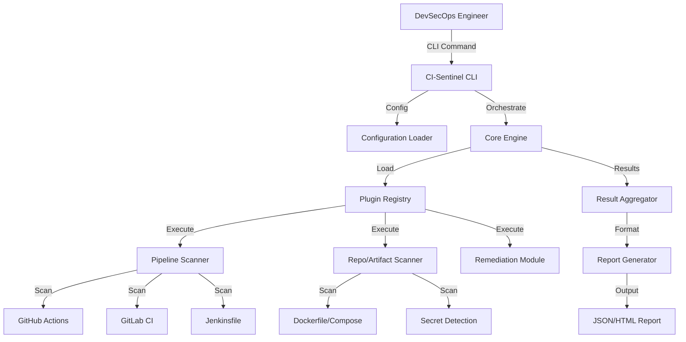

# CI-Sentinel Architecture

## Overview
CI-Sentinel is designed as a modular, enterprise-grade security scanner for CI/CD environments. It operates on a **Zero Trust** principle for build pipelines, assuming that any configuration or artifact could potentially be compromised or insecurely configured.

The system is built in Go, emphasizing performance, portability, and strong typing. It is composed of a lightweight **Core**, a **Plugin System** for extensibility, and a **Rule Engine** for policy enforcement.

## High-Level Diagrams

### System Context


## Core Components

### 1. The Core Engine (`pkg/core`)
The brain of the operation. It is responsible for:
- **Lifecycle Management**: Initialization, execution, and cleanup.
- **Plugin Orchestration**: Loading enabled plugins based on configuration/flags.
- **Concurrency Control**: Managing worker pools for parallel scanning of large repositories.
- **Event Bus**: Internal pub/sub for decoupled communication between modules (e.g., a "SecretFound" event could trigger multiple handlers).

### 2. The Plugin System (`pkg/plugin`)
To ensure extensibility and clean separation of concerns, functionality is encapsulated in plugins.
- **Interface Definition**: All scanners must implement the `Scanner` interface.
  ```go
  type Scanner interface {
      Name() string
      Run(ctx context.Context, target Target) ([]Result, error)
      Type() ScanType // Pipeline, Artifact, Secret
  }
  ```
- **Registration**: Plugins register themselves at init time.

### 3. The Rules Engine (`pkg/rules`)
Separates policy from logic.
- **OPA/Rego (Potential)** or **YAML-based** native definitions.
- **Policy Profiles**:
  - `owasp`: Top 10 CI/CD Security Risks.
  - `cis`: benchmarks for Docker/Kubernetes.
  - `enterprise`: Strict internal compliance (customizable).
  
### 4. Remediation Module (`internal/remediation`)
Handles the "fix" logic responsibly.
- **Atomic Operations**: Changes are calculated completely before writing.
- **Diff Generation**: Provides a unified diff for user review (`--dry-run`).
- **Backup Strategy**: Automatic `.bak` creation before modification.

## Directory Structure

```text
ci-sentinel/
├── cmd/
│   └── ci-sentinel/       # Main entry point
├── pkg/
│   ├── config/            # Configuration structs and loaders
│   ├── core/              # Core logic and interfaces
│   ├── models/            # Shared domains (Result, Vulnerability)
│   ├── plugin/            # Plugin system interfaces
│   └── rules/             # Rule definitions and loader
├── internal/
│   ├── scanners/          # Concrete implementations of scanners
│   │   ├── pipeline/      # GH Actions, GitLab, Jenkins
│   │   ├── container/     # Dockerfile, Compose
│   │   └── secrets/       # Entropy/Regex based secret detection
│   ├── remediation/       # Fix logic
│   └── report/            # HTML/JSON generators
├── docs/                  # Architecture and design docs
└── examples/              # Sample configs and insecure pipelines for testing
```

## Security & Compliance
- **Static Analysis Only**: No code execution of scanned files.
- **No Persistence**: Does not store code or secrets.
- **Memory Safety**: Leveraging Go's safe memory management.
- **SBOM**: The tool itself generates an SBOM during build.

## Technology Stack
- **Language**: Go 1.21+
- **CLI Framework**: Cobra (standard for Go CLIs)
- **Configuration**: Viper (YAML/JSON/Env support)
- **Styling**: Lipgloss (for beautiful CLI output)
- **Templating**: Go `html/template` for reports
